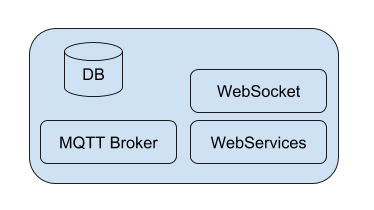

# iota-backend

## How to configure

Innanzitutto è necessario installare le dipendenze:

```
$ npm install
```

Per seconda cosa è necessario mosquitto mqtt Broker:

### Ubuntu

```
$ sudo apt-add-repository ppa:mosquitto-dev/mosquitto-ppa
$ sudo apt-get update
$ sudo apt-get install mosquitto
$ sudo apt-get install mosquitto-clients
```

Quando si installa mosquitto dal package manager questo fa partire mosquitto sulla porta 3883.

N.B. Alcuni OS quando installi mosquitto dal package manager lo avviano come servizio sulla porta standard (1883).
Il nostro progetto richiede mosquitto sulla porta 3883 perchè tira su MQTT broker attraverso Mosca sulla porta 1883.

Per stoppare e far partire il servizio è necessario eseguire:

```
$ sudo service stop mosquitto #see note later
```
Nel caso il comando precedente non dovesse funzionare, prego provare:

```
$ sudo /etc/init.d/mosquitto stop
```

o qualora il sistema utilizzi systemd:

```
$ sudo systemctl stop mosquitto
```

E quindi far partire mosquitto sulla porta 3883:

```
$ mosquitto -p 3883
```

### Mac OSX

```
$ brew update
$ brew install mosquitto
```


E quindi far partire mosquitto sulla porta 3883:

```
$ mosquitto -p 3883
```

## How to use

Il servizio espone all'indirizzo `http://{host}/` un sito "statico", nel nostro scenario
è previsto che il servizio esponga la nostra WebApp, la `iota-dashboard`.
Il sito deve essere collocato nella cartella `webapp`.
Per i dettagli riguardanti una compilazione per della dashboard per la produzione vedere il progetto `iota-dashboard`.

```
$ node index.js
```

## Theory about Backend element

### Intro
L’elaborato che abbiamo deciso di scrivere per testare iota si compone di tre principali elementi:
- IoTa Backend.
- IoTa Board.
- IoTa Dashboard.

L’idea è costruire un sistema che permetta ad un sensore di manifestare la propria presenza sul cloud 
e che permetta ad una Dashboard di interagire con quest’ultimo on demand.


### Backend



Al fine di creare una scenario IoT verosimile abbiamo sviluppato una piccola app in node.js che offre i servizi di storage, broker MQTT e WebServer (REST + WebSocket).
L’idea generale è che il backend esponga un servizio MQTT per i “devices”, un servizio che consenta, da un lato, a tutti i sensori e/o agli aggregatori di sensori di manifestare la propria presenza nel network IoT, dall’altro a tutti gli utilizzatori di reperire le informazioni riguardanti i device disponibili al fine di essere in grado di instaurare una connessione end to end con essi.
Il device durante la fase di bootstrap manifesta la sua presenza al backend via mqtt al topic “/device”.

```javascript
mqttServer.on('published', function (packet, client) {
    console.log('[INFO] MQTT client Published at ' + new Date());

    console.log(packet.payload.toString());
    if(packet.topic === 'devices')
    {
      let alreadyExist = false;
      let data = JSON.parse(packet.payload.toString());
      console.log(data);
      for(let i=0;i<devices.length;i++)
      {
          if(devices[i].root===data.root){
              alreadyExist=true;
          }
      }
      if(!alreadyExist){
        devices.push(data);
        io.emit("devices", devices);
      }
    }
});
```

Dall’altra parte l’api REST esposta dal web server permetterà agli utilizzatori di questa infrastruttura, per esempio ad una WebApp di prendere informazioni sui dispositivi per poi essere in grado di instaurare una connessione.

```javascript
app.get('/devices', function (req, res){
    let onlineDevices = db.collection('devices').find();
    res.json(onlineDevices);
});
```

Parallelamente la stessa operazione può essere fatta via WebSocket, alla connessione di un client sul socket o alla pubblicazione di un nuovo device via mqtt.

```javascript
io.on('connection', (socket) => {
    console.log('[INFO] WebSocket user connected');
  
    io.emit("devices", devices);
    ...

});
```
