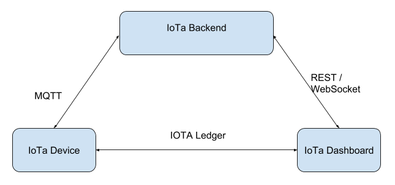
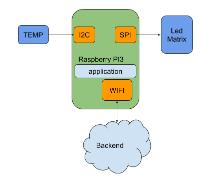

# iota-board

## How to use

Il software necessita l'indirizzo di un server MQTT al quale connettersi.
L'indirizzo può essere passato come argomento, se nessun argomento è passato
si presuppone che il software sia nello scenario sviluppo e che il servizio sia locale, verrà quindi utilizzato `127.0.0.1` come server address.
Passando un secondo parametro possiamo determinare il nome con il quale la nostra board si "manifesterà" sul broker MQTT
ES:
```
$ node index.js 192.168.1.100 Board1
```

## Theory about Board element

L’elaborato che abbiamo deciso di scrivere per testare iota si compone di tre principali elementi:
- IoTa Backend.
- IoTa Board.
- IoTa Dashboard.

L’idea è costruire un sistema che permetta ad un sensore di manifestare la propria presenza sul cloud 
e che permetta ad una Dashboard di interagire con quest’ultimo on demand.




Una iota board è un device del network IoT, il suo compito è quello di pubblicare le informazioni dei propri sensori (grezze o aggregate) e di comandare eventualmente alcuni attuatori.
Nel nostro caso utilizzeremo un Raspberry Pi 3 connesso WIFI che avrà come attuatore una led matrix connessa via SPI ed un sensore di temperatura (simulato).
La led matrix mostra i messaggi inviati dalla dashboard mentre il sensore di temperatura viene visualizzato sulla dashboard.
All’inizializzazione il dispositivo genera dal proprio seed privato, seed che caratterizza il device in modo univoco, un address.     

```javascript
let mamState = Mam.init(iota, undefined,"1");
let root = Mam.getRoot(mamState);
```

L’address iota è nella terminologia MAM (masked authenticated messaging) la root di quello specifico seed.

In iota ogni “outgoing transaction”, transazione in uscita, dovrebbe essere eseguita da address diversi, che sono comunque associabili ad un solo seed.
Nel nostro scenario durante l’inizializzazione, dopo aver generato l’indirizzo, il device pubblica via mqtt la propria presenza al backend.

Nella pubblicazione di presenza c’è anche l’indirizzo del device sul tangle.

```javascript
//publish the device presence trought MQTT
client.publish('devices', JSON.stringify({
    name: "IoTa Board", 
    root:root
}));
```

Un’eventuale utilizzatore sarà quindi in grado di inviare informazioni al device tramite il tangle utilizzando appunto il suo indirizzo.
Il device sarà infatti in ascolto di nuovi messaggi sullo specifico indirizzo.

Parallelamente sempre tramite l’ausilio del backend e del canale MQTT al quale è sottoscritto, il device può ricevere l’indirizzo della Dashboard per pubblicare informazioni.


